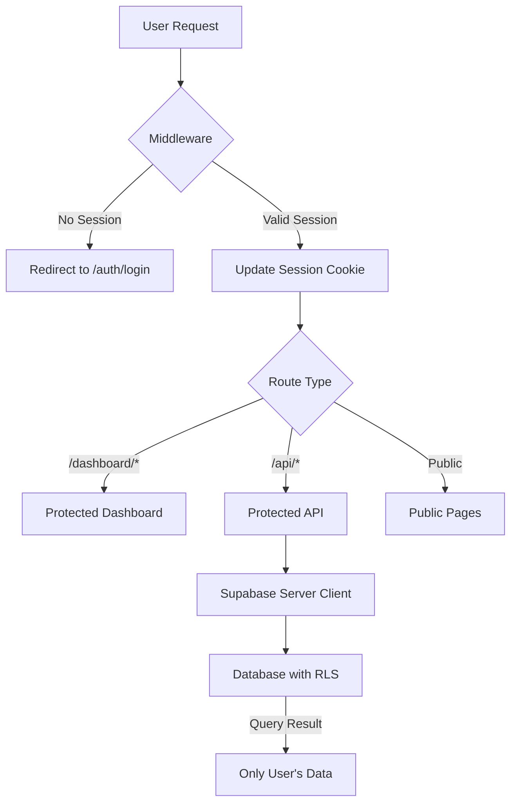
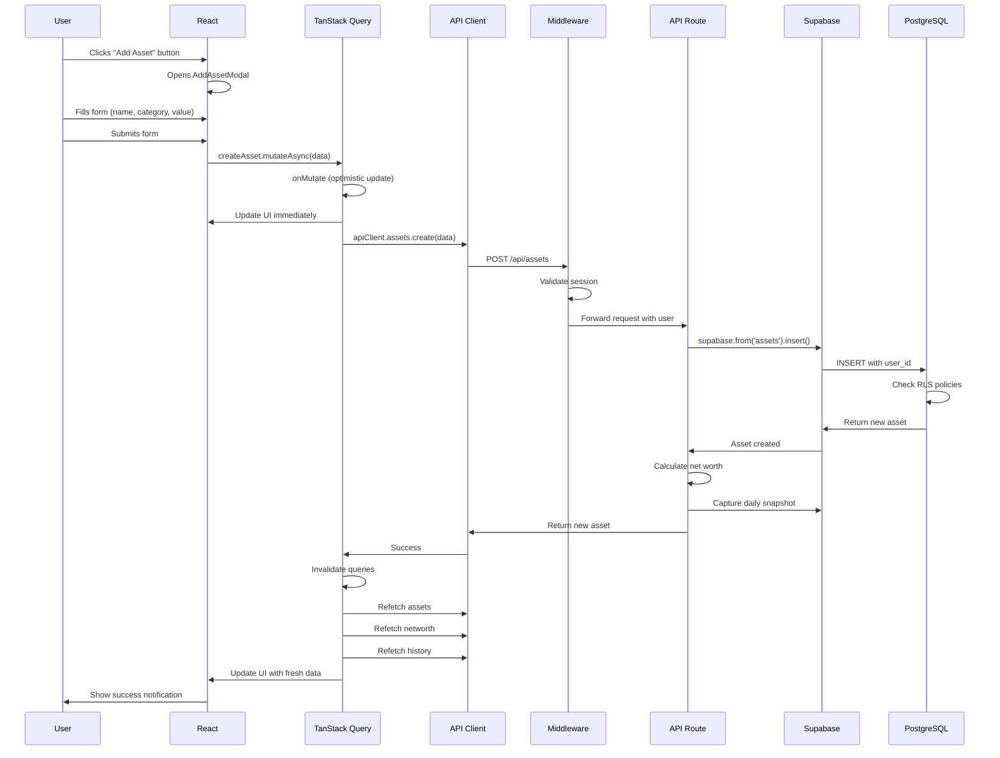
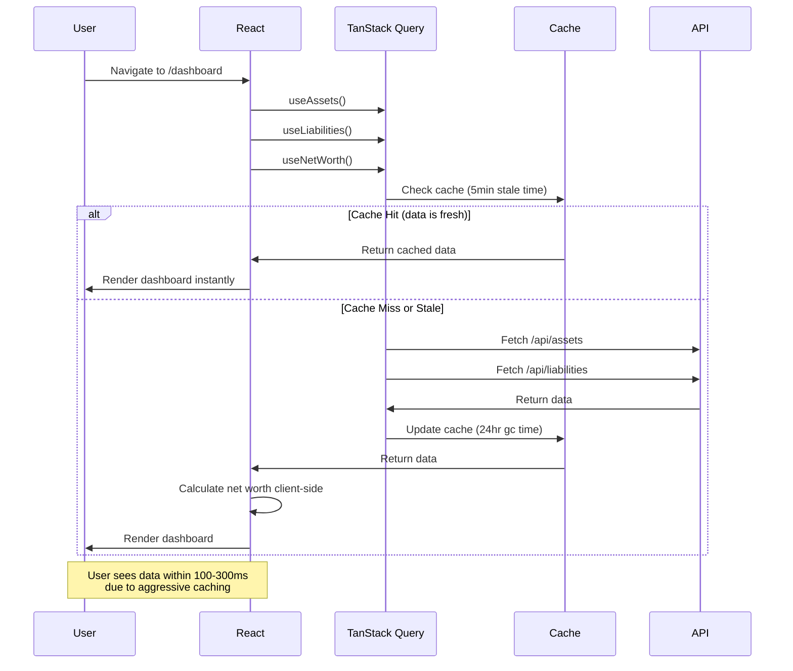
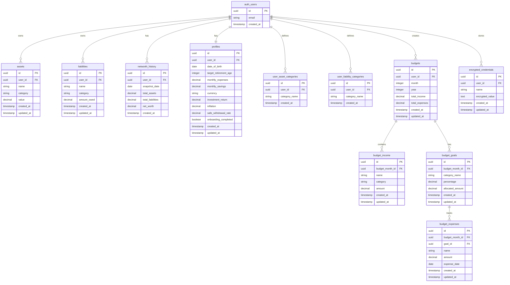
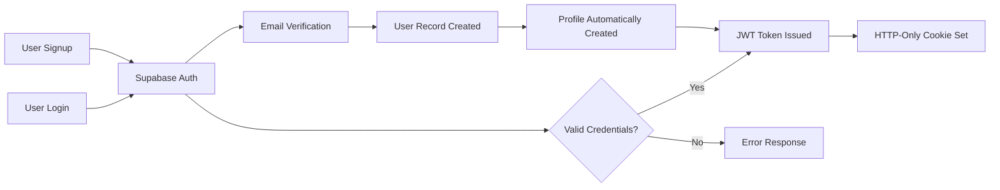

# System Architecture

## High-Level Design

Net Worth Tracker follows a modern **Monolithic Single-Page Application (SPA)** architecture powered by Next.js 15 with the App Router. The application is structured as:

- **Frontend**: Client-side React components with TanStack Query for state management
- **Backend**: Next.js API Routes serving as the application backend
- **Database**: Supabase PostgreSQL with Row Level Security (RLS)
- **Authentication**: Supabase Auth with middleware-based session management
- **External APIs**: Third-party integrations (Trading 212) with encrypted credentials

### Architecture Pattern

```
┌──────────────────────────────────────────────────────────────────┐
│                        Browser (Client)                          │
│  ┌────────────────────────────────────────────────────────────┐  │
│  │  React Components (Client Components with "use client")    │  │
│  │  - Dashboard, Assets, Liabilities, FIRE, Budgets          │  │
│  │  - Hooks: useAssets, useLiabilities, useNetWorth          │  │
│  └────────────────────────────────────────────────────────────┘  │
│                            ↕ (TanStack Query)                     │
│  ┌────────────────────────────────────────────────────────────┐  │
│  │  API Client (src/lib/api-client.ts)                        │  │
│  │  - Centralized fetch wrapper with auth headers            │  │
│  │  - Type-safe API methods                                   │  │
│  └────────────────────────────────────────────────────────────┘  │
└──────────────────────────────────────────────────────────────────┘
                            ↕ (HTTP/JSON)
┌──────────────────────────────────────────────────────────────────┐
│                    Next.js Server (Node.js)                      │
│  ┌────────────────────────────────────────────────────────────┐  │
│  │  Middleware (src/middleware.ts)                            │  │
│  │  - Session validation (Supabase Auth)                      │  │
│  │  - Route protection (/dashboard/*, /api/*)                 │  │
│  └────────────────────────────────────────────────────────────┘  │
│                            ↕                                      │
│  ┌────────────────────────────────────────────────────────────┐  │
│  │  API Routes (src/app/api/*)                                │  │
│  │  - /api/assets, /api/liabilities                           │  │
│  │  - /api/networth, /api/history                             │  │
│  │  - /api/fire, /api/budgets, /api/profiles                  │  │
│  │  - /api/trading212 (external integration)                  │  │
│  └────────────────────────────────────────────────────────────┘  │
│                            ↕                                      │
│  ┌────────────────────────────────────────────────────────────┐  │
│  │  Supabase Client (Server-side)                             │  │
│  │  - src/lib/supabase/server.ts (for API routes)             │  │
│  │  - src/lib/supabase/middleware.ts (for middleware)         │  │
│  └────────────────────────────────────────────────────────────┘  │
└──────────────────────────────────────────────────────────────────┘
                            ↕ (PostgreSQL Protocol)
┌──────────────────────────────────────────────────────────────────┐
│                      Supabase (BaaS)                             │
│  ┌────────────────────────────────────────────────────────────┐  │
│  │  PostgreSQL Database                                        │  │
│  │  Tables: assets, liabilities, networth_history,           │  │
│  │          profiles, budgets, budget_income,                 │  │
│  │          budget_expenses, budget_goals,                    │  │
│  │          user_asset_categories,                            │  │
│  │          user_liability_categories,                        │  │
│  │          encrypted_credentials                             │  │
│  │                                                             │  │
│  │  Row Level Security (RLS): All tables have policies       │  │
│  │  ensuring users can only access their own data            │  │
│  └────────────────────────────────────────────────────────────┘  │
│  ┌────────────────────────────────────────────────────────────┐  │
│  │  Auth System (Supabase Auth)                               │  │
│  │  - Email/password authentication                           │  │
│  │  - Session management via JWT                              │  │
│  │  - User creation and verification                          │  │
│  └────────────────────────────────────────────────────────────┘  │
└──────────────────────────────────────────────────────────────────┘
                            ↕ (HTTPS/REST)
┌──────────────────────────────────────────────────────────────────┐
│                      External APIs                               │
│  ┌────────────────────────────────────────────────────────────┐  │
│  │  Trading 212 API (live.trading212.com)                     │  │
│  │  - Portfolio positions                                      │  │
│  │  - Account cash balances                                    │  │
│  │  - Encrypted API keys stored in database                   │  │
│  └────────────────────────────────────────────────────────────┘  │
└──────────────────────────────────────────────────────────────────┘
```

## Component Breakdown

### 1. Frontend Layer (Client Components)

**Responsibility**: User interface, state management, and user interactions

**Key Technologies**:

- React 19 with Next.js 15 App Router
- TanStack Query for server state
- Framer Motion for animations
- Tailwind CSS for styling

**Major Components**:

| Component              | Location                                | Purpose                                       |
| ---------------------- | --------------------------------------- | --------------------------------------------- |
| **Dashboard**          | `src/components/Dashboard/`             | Main dashboard with net worth summary, charts |
| **AssetsSection**      | `src/components/Dashboard/Assets/`      | Asset management UI                           |
| **LiabilitiesSection** | `src/components/Dashboard/Liabilities/` | Liability management UI                       |
| **FIRE Calculator**    | `src/components/Dashboard/FIRE/`        | FIRE planning and visualization               |
| **Budget Tracker**     | `src/components/Budget/`                | Monthly budget management                     |
| **Settings**           | `src/components/Settings/`              | User preferences, account connections         |

**State Management Pattern**:

```typescript
// All data fetching uses TanStack Query hooks
const { data: assets, isLoading } = useAssets();
const createAsset = useCreateAsset();

// Mutations trigger automatic cache invalidation
await createAsset.mutateAsync({ name, category, value });
// → Invalidates assets, networth, and history queries
// → Captures daily snapshot automatically
```

### 2. API Layer (Next.js API Routes)

**Responsibility**: Business logic, data validation, database operations

**Location**: `src/app/api/`

**Key Routes**:

| Route                   | Methods                | Purpose                      |
| ----------------------- | ---------------------- | ---------------------------- |
| `/api/assets`           | GET, POST, PUT, DELETE | Asset CRUD operations        |
| `/api/liabilities`      | GET, POST, PUT, DELETE | Liability CRUD operations    |
| `/api/networth`         | GET                    | Calculate current net worth  |
| `/api/history`          | GET, POST              | Historical snapshots         |
| `/api/fire`             | GET                    | FIRE calculation             |
| `/api/profiles`         | GET, PUT               | User profile and preferences |
| `/api/budgets`          | GET, POST, PUT, DELETE | Budget management            |
| `/api/budgets/income`   | POST, PUT, DELETE      | Income sources               |
| `/api/budgets/expenses` | POST, PUT, DELETE      | Expense tracking             |
| `/api/budgets/goals`    | POST, PUT, DELETE      | Budget goals                 |
| `/api/trading212/sync`  | POST                   | Trading 212 synchronization  |
| `/api/credentials`      | GET, POST, PUT, DELETE | Encrypted credentials        |

**Authentication Flow**:

```typescript
// All API routes are protected by middleware
// Middleware validates Supabase session before request reaches route
// Routes access user via: const { data: { user } } = await supabase.auth.getUser()
```

### 3. Database Layer (Supabase PostgreSQL)

**Responsibility**: Data persistence, Row Level Security, user data isolation

**Schema Location**: `supabase/migrations/`

**Key Tables**:

| Table                       | Purpose                             | RLS |
| --------------------------- | ----------------------------------- | --- |
| `assets`                    | User assets with value and category | ✅  |
| `liabilities`               | User debts with amount owed         | ✅  |
| `networth_history`          | Daily snapshots of net worth        | ✅  |
| `profiles`                  | User profile and FIRE preferences   | ✅  |
| `user_asset_categories`     | Custom asset categories             | ✅  |
| `user_liability_categories` | Custom liability categories         | ✅  |
| `budgets`                   | Monthly budget data                 | ✅  |
| `budget_income`             | Income sources per budget           | ✅  |
| `budget_expenses`           | Expenses per budget                 | ✅  |
| `budget_goals`              | Budget category goals               | ✅  |
| `encrypted_credentials`     | Encrypted third-party API keys      | ✅  |

**Security Model**:

- Every table has `user_id UUID REFERENCES auth.users(id)`
- RLS policies ensure `auth.uid() = user_id` for all operations
- No API route can bypass RLS (enforced at database level)

### 4. Authentication & Authorization

**Responsibility**: User identity, session management, route protection

**Components**:



**Session Flow**:

1. User logs in via `/auth/login` → Supabase Auth creates session
2. Session stored as HTTP-only cookie
3. Middleware validates session on every request
4. API routes extract `user_id` from validated session
5. Database RLS enforces user data isolation

## Data Flow: Typical User Interaction

### Example: Adding a New Asset



### Example: Viewing Net Worth Dashboard



## Database Schema



## Security Architecture

### 1. Authentication Flow



### 2. Request Authorization Flow

```
1. Request → Middleware
2. Middleware extracts session cookie
3. Middleware validates JWT with Supabase
4. If valid: Request continues to API Route
5. API Route gets user_id from session
6. API Route queries database with user_id
7. Database RLS checks auth.uid() = user_id
8. Only matching rows returned
```

### 3. Row Level Security (RLS) Example

```sql
-- Assets table RLS policy
CREATE POLICY "Users can view their own assets"
ON assets FOR SELECT
USING (auth.uid() = user_id);

-- This ensures:
-- SELECT * FROM assets WHERE user_id = '<any-id>'
-- → Only returns rows where user_id = authenticated user's ID
-- → Impossible to query other users' data
```

## Performance Optimizations

### 1. Caching Strategy

| Layer                  | Strategy            | Duration           | Invalidation        |
| ---------------------- | ------------------- | ------------------ | ------------------- |
| **TanStack Query**     | In-memory cache     | 24 hours (gc time) | On mutation success |
| **Stale Time**         | Consider data fresh | 5 minutes          | Auto-refetch after  |
| **Optimistic Updates** | Immediate UI update | N/A                | Rollback on error   |
| **Trading 212**        | Server-side cache   | 24 hours           | Manual via sync     |

### 2. Optimistic Updates Pattern

```typescript
// Example from useDeleteAsset hook
onMutate: async (assetId) => {
  // 1. Cancel outgoing refetches
  await queryClient.cancelQueries({ queryKey: queryKeys.assets });

  // 2. Snapshot current state
  const previousAssets = queryClient.getQueryData<Asset[]>(queryKeys.assets);

  // 3. Optimistically update cache
  queryClient.setQueryData<Asset[]>(queryKeys.assets, (old) => {
    return old ? old.filter((asset) => asset.id !== assetId) : [];
  });

  // 4. Return rollback context
  return { previousAssets };
},
onError: (err, assetId, context) => {
  // 5. Rollback on error
  if (context?.previousAssets) {
    queryClient.setQueryData(queryKeys.assets, context.previousAssets);
  }
},
```

### 3. Automatic Snapshot Creation

Every asset/liability mutation automatically captures a daily snapshot:

```typescript
// After successful mutation
apiClient.history.captureSnapshot().catch((error) => {
  console.error('Error capturing snapshot:', error);
});
// → Upserts today's snapshot in networth_history
// → Enables historical tracking without manual intervention
```

## Next Steps

Continue to:

- [Local Development Setup](./03-LOCAL-DEVELOPMENT.md) - Get the project running
- [Codebase Tour](./04-CODEBASE-TOUR.md) - Navigate the file structure
- [Core Modules](./05-CORE-MODULES.md) - Deep dive into critical modules
