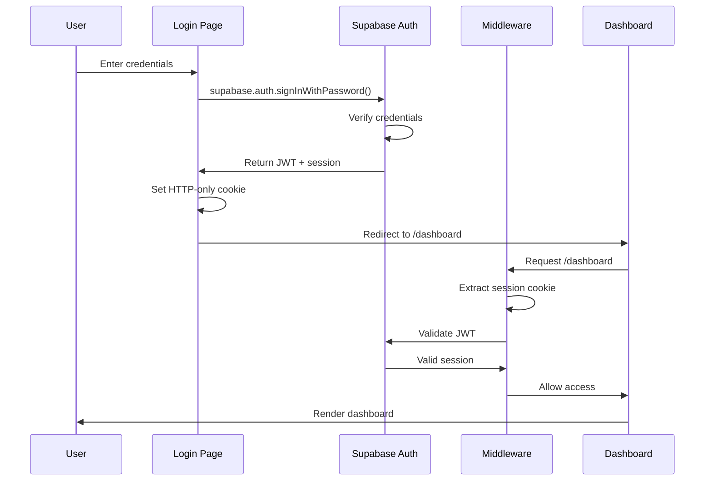
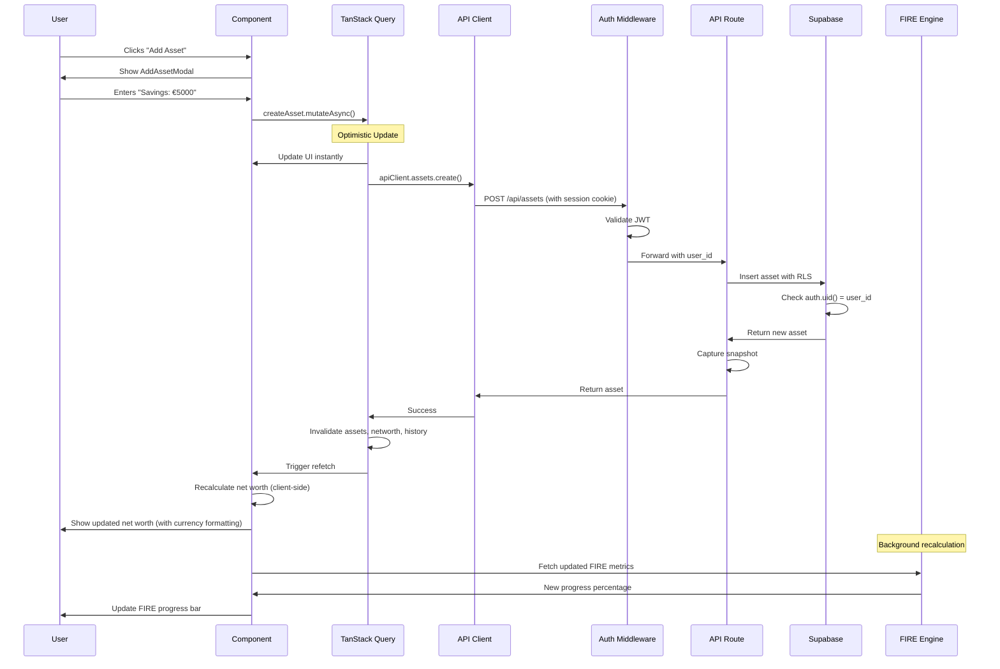

# Core Modules Deep Dive

This document provides detailed explanations of the 5 most critical modules in the Net Worth Tracker application. Understanding these modules is essential for contributing effectively to the codebase.

## Table of Contents

1. [State Management (TanStack Query)](#1-state-management-tanstack-query)
2. [API Client Architecture](#2-api-client-architecture)
3. [Authentication & Authorization](#3-authentication--authorization)
4. [Currency System](#4-currency-system)
5. [FIRE Calculations Engine](#5-fire-calculations-engine)

---

## 1. State Management (TanStack Query)

### Purpose

TanStack Query (React Query) serves as the primary state management solution for all server state. It replaces traditional state management libraries (Redux, Zustand) by providing:

- Automatic caching with configurable staleness
- Optimistic updates for instant UI feedback
- Automatic background refetching
- Request deduplication
- Cache invalidation strategies

### Location

- **Configuration**: `src/app/providers.tsx`
- **Hooks**: `src/hooks/use-financial-data.ts`, `src/hooks/use-fire-data.ts`, `src/hooks/use-profile.ts`
- **Query Keys**: `src/hooks/use-financial-data.ts:8-14`

### Key Configuration

**File**: `src/app/providers.tsx:10-33`

```typescript
const [queryClient] = useState(
  () =>
    new QueryClient({
      defaultOptions: {
        queries: {
          // Data considered fresh for 5 minutes
          staleTime: 5 * 60 * 1000,

          // Keep data in cache for 24 hours after last use
          gcTime: 24 * 60 * 60 * 1000,

          // Retry failed requests 3 times
          retry: 3,

          // Exponential backoff: 1s, 2s, 4s (max 30s)
          retryDelay: (attemptIndex) =>
            Math.min(1000 * 2 ** attemptIndex, 30000),

          // Refetch when user focuses window
          refetchOnWindowFocus: true,

          // Always refetch on reconnect
          refetchOnReconnect: "always",
        },
        mutations: {
          // Retry failed mutations once
          retry: 1,
        },
      },
    }),
);
```

### Query Keys Strategy

**File**: `src/hooks/use-financial-data.ts:8-14`

```typescript
export const queryKeys = {
  assets: ["assets"] as const,
  liabilities: ["liabilities"] as const,
  networth: ["networth"] as const,
  history: ["history"] as const,
};
```

**Why This Matters**:

- Query keys uniquely identify cached data
- Invalidating a query key triggers refetch
- Shared across all components for consistency
- Type-safe with TypeScript `as const`

### Core Hooks

#### `useAssets()` - Fetch Assets

**File**: `src/hooks/use-financial-data.ts:17-22`

```typescript
export function useAssets() {
  return useQuery({
    queryKey: queryKeys.assets,
    queryFn: apiClient.assets.getAll,
  });
}
```

**Usage in Components**:

```typescript
const { data: assets = [], isLoading, error } = useAssets();

if (isLoading) return <Skeleton />;
if (error) return <ErrorMessage error={error} />;

return <AssetsList assets={assets} />;
```

#### `useCreateAsset()` - Create Asset with Optimistic Update

**File**: `src/hooks/use-financial-data.ts:24-45`

```typescript
export function useCreateAsset() {
  const queryClient = useQueryClient();

  return useMutation({
    mutationFn: apiClient.assets.create,
    onSuccess: (newAsset) => {
      // 1. Optimistically update cache immediately
      queryClient.setQueryData<Asset[]>(queryKeys.assets, (old) => {
        return old ? [...old, newAsset] : [newAsset];
      });

      // 2. Invalidate to ensure fresh data from server
      queryClient.invalidateQueries({ queryKey: queryKeys.assets });
      queryClient.invalidateQueries({ queryKey: queryKeys.networth });
      queryClient.invalidateQueries({ queryKey: queryKeys.history });

      // 3. Capture daily snapshot (async, don't wait)
      apiClient.history.captureSnapshot().catch((error) => {
        console.error("Error capturing snapshot after asset update:", error);
      });
    },
  });
}
```

**Why This Pattern**:

1. **Optimistic Update**: UI updates immediately, no loading spinner
2. **Invalidation**: Ensures server is source of truth
3. **Cascade Invalidation**: Net worth and history depend on assets, so they're also invalidated
4. **Snapshot**: Historical tracking happens automatically

#### `useDeleteAsset()` - Delete with Rollback

**File**: `src/hooks/use-financial-data.ts:73-105`

```typescript
export function useDeleteAsset() {
  const queryClient = useQueryClient();

  return useMutation({
    mutationFn: apiClient.assets.delete,
    onMutate: async (assetId) => {
      // Cancel any outgoing refetches (prevent race conditions)
      await queryClient.cancelQueries({ queryKey: queryKeys.assets });

      // Snapshot the previous value for rollback
      const previousAssets = queryClient.getQueryData<Asset[]>(
        queryKeys.assets,
      );

      // Optimistically update (remove asset from UI)
      queryClient.setQueryData<Asset[]>(queryKeys.assets, (old) => {
        return old ? old.filter((asset) => asset.id !== assetId) : [];
      });

      // Return context for potential rollback
      return { previousAssets };
    },
    onError: (err, assetId, context) => {
      // If mutation fails, rollback to previous state
      if (context?.previousAssets) {
        queryClient.setQueryData(queryKeys.assets, context.previousAssets);
      }
    },
    onSettled: () => {
      // Always refetch after error or success to ensure consistency
      queryClient.invalidateQueries({ queryKey: queryKeys.assets });
      queryClient.invalidateQueries({ queryKey: queryKeys.networth });
      queryClient.invalidateQueries({ queryKey: queryKeys.history });
    },
  });
}
```

**Rollback Flow**:

1. User clicks delete → Asset disappears from UI instantly
2. If server returns error → Asset reappears (rollback)
3. If server succeeds → Asset stays deleted, fresh data fetched

### Client-Side Calculation Pattern

**File**: `src/hooks/use-financial-data.ts:208-242`

```typescript
export function useNetWorth() {
  const { data: assets } = useAssets();
  const { data: liabilities } = useLiabilities();

  // Calculate net worth from cached data (instant)
  const calculatedNetWorth = useMemo(() => {
    if (!assets || !liabilities) return null;

    const totalAssets = assets.reduce(
      (sum, asset) => sum + Number(asset.value),
      0,
    );
    const totalLiabilities = liabilities.reduce(
      (sum, liability) => sum + Number(liability.amount_owed),
      0,
    );

    return {
      totalAssets,
      totalLiabilities,
      netWorth: totalAssets - totalLiabilities,
      updatedAt: new Date().toISOString(),
    };
  }, [assets, liabilities]);

  // Also fetch from API for validation
  const query = useQuery({
    queryKey: queryKeys.networth,
    queryFn: apiClient.networth.get,
    enabled: !!assets && !!liabilities, // Only fetch after assets/liabilities loaded
  });

  // Return calculated value (instant) or API value (fallback)
  return {
    ...query,
    data: calculatedNetWorth || query.data,
  };
}
```

**Why This Pattern**:

- Net worth calculation is deterministic (assets - liabilities)
- Calculate client-side from cached data = instant display
- Still fetch from API to validate = ensures accuracy
- Best of both worlds: speed + reliability

---

## 2. API Client Architecture

### Purpose

The API Client provides a centralized, type-safe interface for all HTTP communication with the backend. It abstracts fetch logic, handles authentication, and provides consistent error handling.

### Location

**File**: `src/lib/api-client.ts`

### Core Structure

```typescript
// Custom error class with status code
export class ApiError extends Error {
  constructor(
    public status: number,
    message: string,
  ) {
    super(message);
    this.name = "ApiError";
  }
}

// Generic fetch wrapper with authentication
async function fetchWithAuth<T>(
  url: string,
  options?: RequestInit,
): Promise<T> {
  const response = await fetch(url, {
    ...options,
    headers: {
      "Content-Type": "application/json",
      ...options?.headers,
    },
    credentials: "include", // Send cookies (session)
  });

  if (!response.ok) {
    const error = await response
      .json()
      .catch(() => ({ error: "Unknown error" }));
    throw new ApiError(
      response.status,
      error.error || `HTTP ${response.status}`,
    );
  }

  return response.json();
}
```

### API Client Namespaces

**File**: `src/lib/api-client.ts:31-153`

```typescript
export const apiClient = {
  // Asset operations
  assets: {
    getAll: () => fetchWithAuth<Asset[]>("/api/assets"),
    create: (data: { name: string; category: string; value: number }) =>
      fetchWithAuth<Asset>("/api/assets", {
        method: "POST",
        body: JSON.stringify(data),
      }),
    update: (
      id: string,
      data: Partial<{ name: string; category: string; value: number }>,
    ) =>
      fetchWithAuth<Asset>("/api/assets", {
        method: "PUT",
        body: JSON.stringify({ id, ...data }),
      }),
    delete: (id: string) =>
      fetchWithAuth<{ success: boolean }>("/api/assets", {
        method: "DELETE",
        body: JSON.stringify({ id }),
      }),
  },

  // Liability operations
  liabilities: {
    getAll: () => fetchWithAuth<Liability[]>("/api/liabilities"),
    create: (data: { name: string; category: string; amount_owed: number }) =>
      fetchWithAuth<Liability>("/api/liabilities", {
        method: "POST",
        body: JSON.stringify(data),
      }),
    // ... similar to assets
  },

  // Net worth calculation
  networth: {
    get: () =>
      fetchWithAuth<{
        totalAssets: number;
        totalLiabilities: number;
        netWorth: number;
        updatedAt: string;
      }>("/api/networth"),
  },

  // Historical snapshots
  history: {
    get: (params?: { startDate?: string; limit?: number }) => {
      // Build query string from params
      const searchParams = new URLSearchParams();
      if (params?.startDate) searchParams.append("startDate", params.startDate);
      if (params?.limit) searchParams.append("limit", params.limit.toString());
      const query = searchParams.toString();

      return fetchWithAuth<{
        history: Array<{
          snapshot_date: string;
          total_assets: string;
          total_liabilities: string;
          net_worth: string;
        }>;
        trend: {
          current: number;
          previous: number;
          change: number;
          changePercentage: number;
          trend: "up" | "down" | "stable";
        } | null;
      }>(`/api/history${query ? `?${query}` : ""}`);
    },
    captureSnapshot: () =>
      fetchWithAuth<{ message: string; date: string }>("/api/history", {
        method: "POST",
      }),
  },

  // User profile
  profiles: {
    get: () => fetchWithAuth<Profile | null>("/api/profiles"),
    update: (
      data: Partial<ProfileFormData> & { onboarding_completed?: boolean },
    ) =>
      fetchWithAuth<Profile>("/api/profiles", {
        method: "PUT",
        body: JSON.stringify(data),
      }),
  },

  // FIRE calculation
  fire: {
    getCalculation: () => fetchWithAuth<FIRECalculation>("/api/fire"),
  },
};
```

### Usage Examples

**Basic GET**:

```typescript
const assets = await apiClient.assets.getAll();
// Returns: Asset[]
```

**POST with data**:

```typescript
const newAsset = await apiClient.assets.create({
  name: "Savings Account",
  category: "Banking",
  value: 5000,
});
// Returns: Asset
```

**Error handling**:

```typescript
try {
  await apiClient.assets.create(data);
} catch (error) {
  if (error instanceof ApiError) {
    console.error(`API Error ${error.status}: ${error.message}`);
    if (error.status === 401) {
      // Unauthorized - redirect to login
    }
  }
}
```

### Why This Pattern

✅ **Type Safety**: All responses are typed with TypeScript  
✅ **Centralized**: Single source of truth for all API calls  
✅ **Consistent Auth**: `credentials: 'include'` on every request  
✅ **Error Handling**: Consistent ApiError across the app  
✅ **Easy Mocking**: Simple to mock for tests

---

## 3. Authentication & Authorization

### Purpose

Handles user identity verification, session management, and route protection using Supabase Auth and Next.js middleware.

### Components

1. **Supabase Auth** - Identity provider (email/password)
2. **Middleware** - Session validation and route protection
3. **Row Level Security (RLS)** - Database-level authorization
4. **Supabase Clients** - Different clients for different contexts

### Middleware: Route Protection

**File**: `src/middleware.ts`

```typescript
import { type NextRequest } from "next/server";
import { updateSession } from "./lib/supabase/middleware";

export async function middleware(request: NextRequest) {
  return await updateSession(request);
}

export const config = {
  matcher: [
    "/((?!_next/static|_next/image|favicon.png|.*\\.(?:svg|png|jpg|jpeg|gif|webp)$).*)",
  ],
};
```

**File**: `src/lib/supabase/middleware.ts` (simplified)

```typescript
export async function updateSession(request: NextRequest) {
  const { pathname } = request.nextUrl;
  const supabase = createServerClient(/* cookies */);

  // Refresh session if expired
  const {
    data: { user },
  } = await supabase.auth.getUser();

  // Protected routes require authentication
  if (pathname.startsWith("/dashboard") || pathname.startsWith("/api")) {
    if (!user) {
      return NextResponse.redirect(new URL("/auth/login", request.url));
    }
  }

  // If logged in and trying to access auth pages, redirect to dashboard
  if (user && pathname.startsWith("/auth")) {
    return NextResponse.redirect(new URL("/dashboard", request.url));
  }

  return response;
}
```

**Protected Routes**:

- `/dashboard/*` - All dashboard pages
- `/api/*` - All API endpoints

### Supabase Client Configurations

**Three separate clients for different contexts**:

#### 1. Client-Side (`src/lib/supabase/client.ts`)

```typescript
import { createBrowserClient } from "@supabase/ssr";

export function createClient() {
  return createBrowserClient(
    process.env.NEXT_PUBLIC_SUPABASE_URL!,
    process.env.NEXT_PUBLIC_SUPABASE_ANON_KEY!,
  );
}
```

**Usage**: Client components, browser-side operations

#### 2. Server-Side (`src/lib/supabase/server.ts`)

```typescript
import { createServerClient } from "@supabase/ssr";
import { cookies } from "next/headers";

export async function createClient() {
  const cookieStore = await cookies();

  return createServerClient(
    process.env.NEXT_PUBLIC_SUPABASE_URL!,
    process.env.NEXT_PUBLIC_SUPABASE_ANON_KEY!,
    {
      cookies: {
        get(name: string) {
          return cookieStore.get(name)?.value;
        },
      },
    },
  );
}
```

**Usage**: API routes, server components, server actions

#### 3. Middleware (`src/lib/supabase/middleware.ts`)

```typescript
import { createServerClient } from "@supabase/ssr";
import { NextRequest, NextResponse } from "next/server";

export async function createClient(request: NextRequest) {
  let response = NextResponse.next({ request });

  const supabase = createServerClient(
    process.env.NEXT_PUBLIC_SUPABASE_URL!,
    process.env.NEXT_PUBLIC_SUPABASE_ANON_KEY!,
    {
      cookies: {
        get(name: string) {
          return request.cookies.get(name)?.value;
        },
        set(name: string, value: string, options: CookieOptions) {
          response.cookies.set({ name, value, ...options });
        },
        remove(name: string, options: CookieOptions) {
          response.cookies.delete({ name, ...options });
        },
      },
    },
  );

  return { supabase, response };
}
```

**Usage**: Middleware only (session refresh, cookie updates)

### Row Level Security (RLS)

**Every database query is automatically scoped to the authenticated user**:

**Example**: Assets table RLS policy

```sql
-- Users can only view their own assets
CREATE POLICY "Users can view their own assets"
ON assets FOR SELECT
USING (auth.uid() = user_id);

-- Users can only insert assets for themselves
CREATE POLICY "Users can insert their own assets"
ON assets FOR INSERT
WITH CHECK (auth.uid() = user_id);

-- Similar policies for UPDATE and DELETE
```

**In API routes**:

```typescript
// File: src/app/api/assets/route.ts
const supabase = await createClient();

// This query ONLY returns assets where user_id = authenticated user
const { data: assets } = await supabase.from("assets").select("*");

// User cannot query other users' assets - database enforces this
```

### Authentication Flow



---

## 4. Currency System

### Purpose

Provides global currency management with multi-currency support, allowing users to view all financial data in their preferred currency with proper locale formatting.

### Location

- **Context**: `src/contexts/CurrencyContext.tsx`
- **Hook**: `src/hooks/use-currency-format.ts`
- **Utilities**: `src/lib/currency.ts`
- **Profile Storage**: `profiles.currency` column

### Currency Context

**File**: `src/contexts/CurrencyContext.tsx`

```typescript
interface CurrencyContextType {
  currency: string; // ISO 4217 code (EUR, USD, GBP)
  setCurrency: (currency: string) => Promise<void>;
  isLoading: boolean;
}

export function CurrencyProvider({ children }: { children: React.ReactNode }) {
  const queryClient = useQueryClient();
  const [currency, setCurrencyState] = useState<string>('EUR');
  const [isLoading, setIsLoading] = useState(true);

  // Fetch profile to get user's currency preference
  useEffect(() => {
    const fetchCurrency = async () => {
      try {
        const profile = await apiClient.profiles.get();
        if (profile?.currency) {
          setCurrencyState(profile.currency);
        }
      } catch (error) {
        console.error('Error fetching currency:', error);
      } finally {
        setIsLoading(false);
      }
    };
    fetchCurrency();
  }, []);

  // Update currency in database and invalidate dependent queries
  const setCurrency = async (newCurrency: string) => {
    const previousCurrency = currency;
    setCurrencyState(newCurrency); // Optimistic update

    try {
      await apiClient.profiles.update({ currency: newCurrency });

      // Invalidate all currency-dependent queries
      queryClient.invalidateQueries({ queryKey: ['profile'] });
      queryClient.invalidateQueries({ queryKey: ['fire-calculation'] });
      queryClient.invalidateQueries({ queryKey: ['networth'] });
    } catch (error) {
      console.error('Error updating currency:', error);
      setCurrencyState(previousCurrency); // Rollback on error
      throw error;
    }
  };

  return (
    <CurrencyContext.Provider value={{ currency, setCurrency, isLoading }}>
      {children}
    </CurrencyContext.Provider>
  );
}

// Hook to access currency context
export function useCurrency() {
  const context = useContext(CurrencyContext);
  if (context === undefined) {
    throw new Error('useCurrency must be used within a CurrencyProvider');
  }
  return context;
}
```

### Currency Formatting Hook

**File**: `src/hooks/use-currency-format.ts`

```typescript
import { useCurrency } from "@/contexts/CurrencyContext";
import { formatCurrency as formatCurrencyUtil } from "@/lib/currency";

export function useCurrencyFormat() {
  const { currency } = useCurrency();

  const formatCurrency = (value: number) => {
    return formatCurrencyUtil(value, currency);
  };

  return { formatCurrency, currency };
}
```

### Currency Formatting Utility

**File**: `src/lib/currency.ts`

```typescript
export function formatCurrency(
  value: number,
  currencyCode: string = "EUR",
): string {
  // Locale mapping for proper formatting
  const localeMap: Record<string, string> = {
    EUR: "de-DE", // €1.234,56
    USD: "en-US", // $1,234.56
    GBP: "en-GB", // £1,234.56
    JPY: "ja-JP", // ¥1,235 (no decimals)
    // ... more currencies
  };

  const locale = localeMap[currencyCode] || "en-US";

  return new Intl.NumberFormat(locale, {
    style: "currency",
    currency: currencyCode,
    minimumFractionDigits: currencyCode === "JPY" ? 0 : 2,
    maximumFractionDigits: currencyCode === "JPY" ? 0 : 2,
  }).format(value);
}
```

### Usage in Components

**Pattern**: Always use the hook, never hardcode currency

```typescript
import { useCurrencyFormat } from '@/hooks/use-currency-format';

export function NetWorthSummary() {
  const { formatCurrency } = useCurrencyFormat();
  const { data: networth } = useNetWorth();

  return (
    <div>
      <h2>Net Worth</h2>
      <p>{formatCurrency(networth.netWorth)}</p>
      <p>Assets: {formatCurrency(networth.totalAssets)}</p>
      <p>Liabilities: {formatCurrency(networth.totalLiabilities)}</p>
    </div>
  );
}
```

**Output Examples**:

- EUR: €12.345,67
- USD: $12,345.67
- GBP: £12,345.67
- JPY: ¥12,346

---

## 5. FIRE Calculations Engine

### Purpose

Implements Financial Independence, Retire Early (FIRE) calculations using compound interest formulas to project retirement timelines based on savings rate, investment returns, and current net worth.

### Location

**File**: `src/lib/fire-calculations.ts`

### Core Formulas

#### 1. Calculate FIRE Number

**Formula**: `FIRE Number = Annual Expenses × (100 / Safe Withdrawal Rate)`

For 4% withdrawal rate (traditional FIRE): `FIRE Number = Annual Expenses × 25`

```typescript
export function calculateFIRENumber(
  annualExpenses: number,
  withdrawalRate: number,
): number {
  return annualExpenses * (100 / withdrawalRate);
}
```

**Example**:

- Annual Expenses: €40,000
- Safe Withdrawal Rate: 4%
- FIRE Number: €40,000 × 25 = €1,000,000

**Rationale**: If you withdraw 4% annually (€40,000) from €1,000,000, your portfolio should last indefinitely (Trinity Study).

#### 2. Calculate FI Percentage

**Formula**: `FI % = (Current Net Worth / FIRE Number) × 100`

```typescript
export function calculateFIPercentage(
  currentNetWorth: number,
  fireNumber: number,
): number {
  if (fireNumber === 0) return 0;
  return Math.min((currentNetWorth / fireNumber) * 100, 100);
}
```

**Example**:

- Current Net Worth: €250,000
- FIRE Number: €1,000,000
- FI Progress: 25%

#### 3. Calculate Years to FIRE (Compound Interest)

**Most complex calculation**: Accounts for current net worth growing at investment return rate AND annual savings being invested and growing.

**Formula**:

```
FV = PV(1+r)^t + PMT[((1+r)^t - 1)/r]

Solving for t:
t = ln((FV + PMT/r) / (PV + PMT/r)) / ln(1+r)

Where:
- FV = Future Value (FIRE Number)
- PV = Present Value (Current Net Worth)
- PMT = Annual Payment (Annual Savings)
- r = Annual Return Rate (as decimal)
- t = Time in years
```

```typescript
export function calculateYearsToFIRE(
  currentNetWorth: number,
  fireNumber: number,
  annualSavings: number,
  annualReturn: number, // as decimal (e.g., 0.07 for 7%)
): number {
  // Already at or past FIRE
  if (fireNumber <= currentNetWorth) {
    return 0;
  }

  // No savings case
  if (annualSavings <= 0) {
    if (annualReturn > 0 && currentNetWorth > 0) {
      // Current net worth grows to FIRE through returns only
      // FV = PV(1+r)^t → t = ln(FV/PV) / ln(1+r)
      const years =
        Math.log(fireNumber / currentNetWorth) / Math.log(1 + annualReturn);
      return Math.max(0, years);
    } else {
      // Impossible to reach FIRE
      return 999;
    }
  }

  // Standard compound interest calculation
  if (annualReturn > 0) {
    const numerator = Math.log(
      (fireNumber + annualSavings / annualReturn) /
        (currentNetWorth + annualSavings / annualReturn),
    );
    const denominator = Math.log(1 + annualReturn);
    return numerator / denominator;
  } else {
    // No returns: simple division
    const remainingAmount = fireNumber - currentNetWorth;
    return remainingAmount / annualSavings;
  }
}
```

**Example Calculation**:

- Current Net Worth: €100,000
- FIRE Number: €1,000,000
- Annual Savings: €30,000
- Annual Return: 7%

```
t = ln((1,000,000 + 30,000/0.07) / (100,000 + 30,000/0.07)) / ln(1.07)
t = ln((1,000,000 + 428,571) / (100,000 + 428,571)) / ln(1.07)
t = ln(1,428,571 / 528,571) / 0.0677
t = ln(2.703) / 0.0677
t = 0.995 / 0.0677
t ≈ 14.7 years
```

### FIRE API Endpoint

**File**: `src/app/api/fire/route.ts`

```typescript
export async function GET(request: Request) {
  const supabase = await createClient();
  const {
    data: { user },
  } = await supabase.auth.getUser();

  if (!user) {
    return NextResponse.json({ error: "Unauthorized" }, { status: 401 });
  }

  // Fetch profile for FIRE assumptions
  const { data: profile } = await supabase
    .from("profiles")
    .select("*")
    .eq("user_id", user.id)
    .single();

  // Calculate current net worth
  const { data: assets } = await supabase.from("assets").select("value");
  const { data: liabilities } = await supabase
    .from("liabilities")
    .select("amount_owed");

  const totalAssets = assets?.reduce((sum, a) => sum + Number(a.value), 0) || 0;
  const totalLiabilities =
    liabilities?.reduce((sum, l) => sum + Number(l.amount_owed), 0) || 0;
  const currentNetWorth = totalAssets - totalLiabilities;

  // Extract profile values
  const monthlyExpenses = profile?.monthly_expenses || 0;
  const monthlySavings = profile?.monthly_savings || 0;
  const investmentReturn = (profile?.investment_return || 7) / 100; // Convert % to decimal
  const safeWithdrawalRate = profile?.safe_withdrawal_rate || 4;

  const annualExpenses = monthlyExpenses * 12;
  const annualSavings = monthlySavings * 12;

  // Calculate FIRE metrics
  const fireNumber = calculateFIRENumber(annualExpenses, safeWithdrawalRate);
  const progressPercentage = calculateFIPercentage(currentNetWorth, fireNumber);
  const yearsToFIRE = calculateYearsToFIRE(
    currentNetWorth,
    fireNumber,
    annualSavings,
    investmentReturn,
  );
  const monthsToFIRE = yearsToFIRE * 12;
  const fireDate = new Date();
  fireDate.setMonth(fireDate.getMonth() + monthsToFIRE);

  return NextResponse.json({
    fireNumber,
    currentNetWorth,
    monthlyExpenses,
    monthlySavings,
    annualExpenses,
    annualSavings,
    yearsToFIRE,
    monthsToFIRE,
    fireDate,
    progressPercentage,
    withdrawalRate: safeWithdrawalRate,
  });
}
```

### FIRE Data Hook

**File**: `src/hooks/use-fire-data.ts`

```typescript
import { useQuery } from "@tanstack/react-query";
import { apiClient } from "@/lib/api-client";

export function useFIRECalculation() {
  return useQuery({
    queryKey: ["fire-calculation"],
    queryFn: apiClient.fire.getCalculation,
    staleTime: 5 * 60 * 1000, // 5 minutes
  });
}
```

### Usage in Components

```typescript
import { useFIRECalculation } from '@/hooks/use-fire-data';
import { useCurrencyFormat } from '@/hooks/use-currency-format';

export function FIREMetrics() {
  const { data: fire, isLoading } = useFIRECalculation();
  const { formatCurrency } = useCurrencyFormat();

  if (isLoading) return <Skeleton />;

  return (
    <div>
      <h2>FIRE Progress</h2>
      <p>FIRE Number: {formatCurrency(fire.fireNumber)}</p>
      <p>Current Net Worth: {formatCurrency(fire.currentNetWorth)}</p>
      <p>Progress: {fire.progressPercentage.toFixed(1)}%</p>
      <p>Years to FIRE: {fire.yearsToFIRE.toFixed(1)}</p>
      <p>Projected FIRE Date: {new Date(fire.fireDate).toLocaleDateString()}</p>
    </div>
  );
}
```

### Visual Representation

The FIRE calculation creates a compound growth projection chart showing:

- Current net worth
- Projected growth over time
- FIRE number target line
- Intersection point (FIRE date)

**Chart Data Generation**:

```typescript
// Generate monthly data points for chart
const months = Math.ceil(yearsToFIRE * 12);
const dataPoints = [];

for (let month = 0; month <= months; month++) {
  const years = month / 12;

  // Future value calculation
  const growthFromCurrent =
    currentNetWorth * Math.pow(1 + investmentReturn, years);
  const growthFromSavings =
    annualSavings *
    ((Math.pow(1 + investmentReturn, years) - 1) / investmentReturn);

  const projectedNetWorth = growthFromCurrent + growthFromSavings;

  dataPoints.push({
    month,
    netWorth: projectedNetWorth,
    fireNumber: fireNumber, // Constant line
  });
}
```

---

## Module Integration Example

### Complete User Flow: Adding an Asset

This example demonstrates how all 5 core modules work together:



**Key Takeaways**:

1. **TanStack Query**: Orchestrates the entire flow with optimistic updates
2. **API Client**: Type-safe communication layer
3. **Auth Middleware**: Transparent security enforcement
4. **Currency System**: Consistent formatting across all displays
5. **FIRE Engine**: Automatic recalculation triggered by net worth changes

---

## Best Practices

### When Working with These Modules

1. **State Management**:
   - Always use TanStack Query hooks, never fetch directly
   - Invalidate dependent queries after mutations
   - Use optimistic updates for instant UX

2. **API Communication**:
   - Use `apiClient` namespace methods, never raw fetch
   - Handle `ApiError` instances in catch blocks
   - Let TanStack Query handle retries

3. **Authentication**:
   - Use correct Supabase client for context (client/server/middleware)
   - Never bypass RLS with service role key in client code
   - Trust middleware for route protection

4. **Currency**:
   - Always use `useCurrencyFormat()` hook
   - Never hardcode currency symbols
   - Pass currency to all formatting functions

5. **FIRE Calculations**:
   - Trust the formulas (validated against Trinity Study)
   - Use API endpoint, don't recalculate client-side
   - Handle edge cases (negative savings, zero returns)

## Next Steps

- [Contributing Guide](./06-CONTRIBUTING.md) - Learn testing, coding style, and PR workflow
